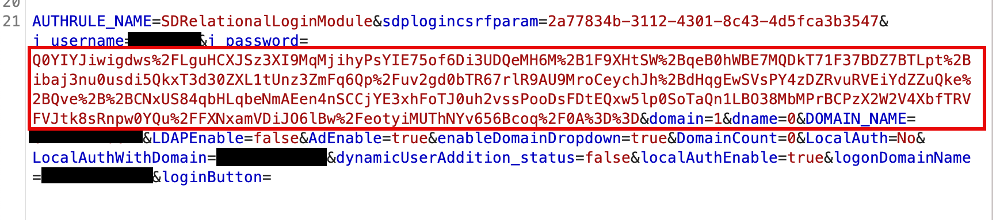
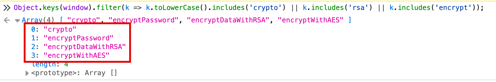
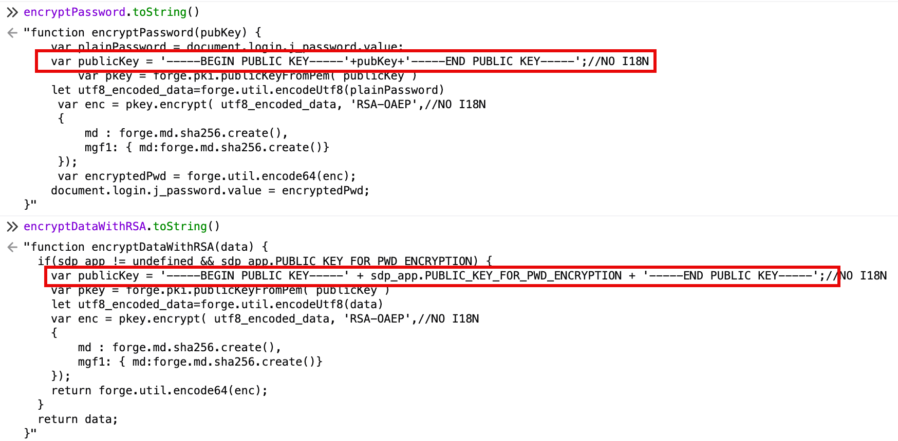
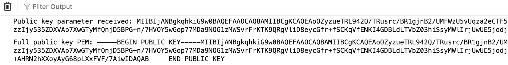

On a recent pentest I discovered a client was hosting a couple of internet-facing ManageEngine applications. These applications are almost always tied to on-prem Active Directory and are a great way to conduct password spraying attacks without involving Entra and O365 endpoints. 

After sending a first login request through BurpSuite I encountered an immediate issue - the submitted password had been turned into a messy, encrypted blob.

> 
> *Password value transformed prior to web request.*

Honestly, I didn't recognize the blob format at first but with some research discovered that it was encrypted via RSA. This implies that there exists a public key used by the front-end somewhere in the loaded scripts. 

## Finding the Public Key

I wasn't really sure where to start, as the form input HTML element didn't give me much to go off of. I started by simply listing any loaded functions containing several keywords like RSA and encryption. To my amazement, this worked - the JS was not obfuscated or properly minified.

> 
> *Finding relevant JavaScript encryption functions.*

There seemed two obvious candidates among them - `encryptPassword` and `encryptDataWithRSA`. I dumped these functions to reveal their simple implementations:

> 
> *Revealing encryption function implementations.*

That confirmed it - RSA encryption was in use for password submission. Unfortunately, the `sdp_app` object didn't appear to be accessible directly from the console. Revealing the public key would rely on hooking the `encryptPassword` function and dumping the passed `pubKey` argument. Whether this was the actual function in use or even the correct public key, I couldn't say for sure. I installed a hook and resubmitted the login - it worked! I revealed the public key's value after attempting a login.

```
// Hook encryptPassword to intercept the public key
window.encryptPassword = function(pubKey) {
    console.log('Public key parameter received:', pubKey);
    console.log('Full public key PEM:', '-----BEGIN PUBLIC KEY-----' + pubKey + '-----END PUBLIC KEY-----');
    return result;
 };
```

> 
> *Extracting public key via function hook.*

## Generating Valid Requests

From here on out, creating the password spray script is similar to many other more "sophisticated" login portals. Most ManageEngine applications require at least one request to obtain a session cookie and CSRF token prior to password submission.

However, they also require the RSA encryption of the password field as we have discovered. The above `encryptPassword` function reveals the exact encryption method we will need to implement: `RSA-OAEP + SHA256`. This can easily be accomplished through the `Pycryptodome` Python library, and integrates seamlessly into existing password spraying scripts using `requests`.

```
import base64
from Crypto.PublicKey import RSA
from Crypto.Cipher import PKCS1_OAEP
from Crypto.Hash import SHA256

def encrypt_password(password: str, public_key_base64: str) -> str:
    # Create PEM format
    pem_key = f"-----BEGIN PUBLIC KEY-----\n{public_key_base64}\n-----END PUBLIC KEY-----"

    # Import key
    key = RSA.import_key(pem_key)

    # Create cipher with OAEP padding using SHA-256
    cipher = PKCS1_OAEP.new(key, hashAlgo=SHA256)

    # Encrypt and return base64
    encrypted_bytes = cipher.encrypt(password.encode('utf-8'))
    return base64.b64encode(encrypted_bytes).decode('utf-8')

# Example usage:
PUBLIC_KEY = "YOUR PUBKEY HERE"

# Encrypt a password
encrypted = encrypt_sdp_password("Password123!", PUBLIC_KEY)
print(f"Encrypted: {encrypted}")
```

One notable aspect of ManageEngine login requests is the **necessity to URL-encode only "key characters"**. In my testing, the application failed to validate logins for fully-encoded or fully-unencoded password fields, even for correct credentials.

Happy spraying!