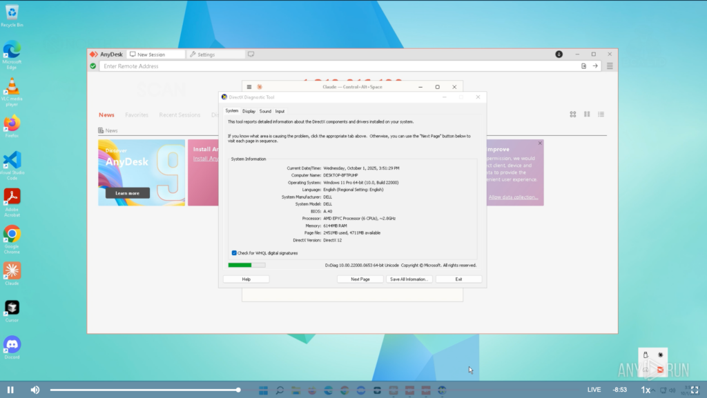
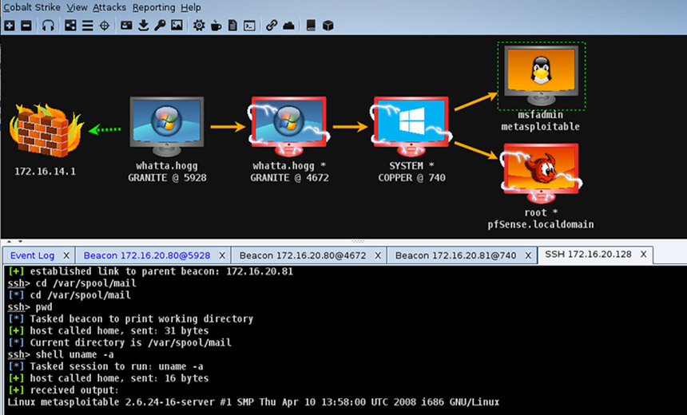
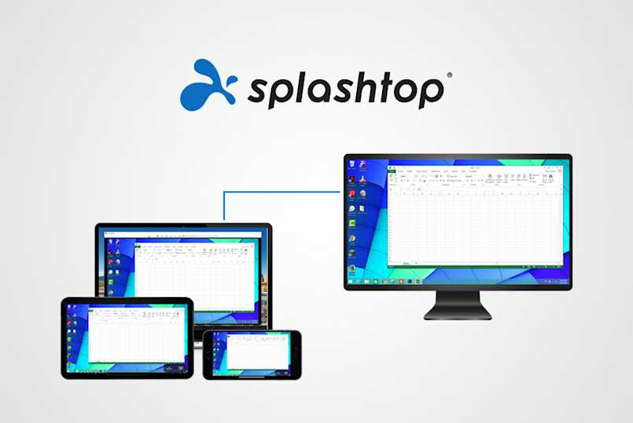
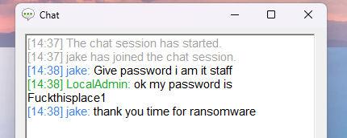
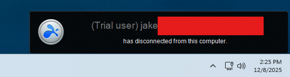
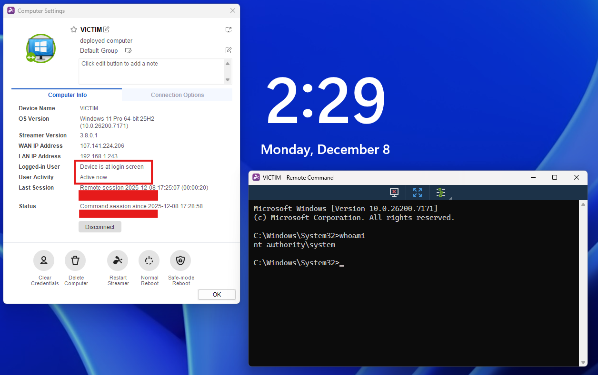

There's a belief in offensive security that impactful red team operations hinge on robust implants, custom C2 profiles, and elaborate execution chains. Entire corners of the industry orbit around loader development, obfuscated payloads, and whatever new post-ex update Cobalt Strike pushed last month.

Recently I took some time to look at the other side of the offensive spectrum - one far more common in real intrusions and involving far less shellcode. This was partly inspired by Any.Run's article on [Lazarus Group's TTPs](https://any.run/cybersecurity-blog/lazarus-group-it-workers-investigation/), which highlights an almost complete absence of custom malware in favor of legitimate remote-access tools like TeamViewer and Chrome Remote Desktop.

> 
> *AnyDesk RMM in use by real Lazarus group operators.*

From an operational standpoint, this preference isn't surprising. Signed binaries with massive enterprise footprints are inherently low-risk from a detection perspective; quarantining or killing a remote-access tool can halt helpdesk work, disrupt production systems, or take critical endpoints offline. EDR engines and junior SOC analysts alike tend to tread carefully around software the organization depends on.

The real drawback for adversaries and red team operators has traditionally been control. Yes - legitimate RMM software will often bypass EDR by default, but drop it on the wrong workstation or launch a session at the wrong time and you won't be bypassing the SOC lead watching your moves in real time. Many RMM tools are also limited, clunky, or missing features operators want from a C2.

## Malware is a Liability

In most breaches, the role of malware is far less than people expect. Custom implants are either introduced late in the operation or never deployed at all - attackers simply don't need them.

> 
> *The user interface for Cobalt Strike, a popular C2 choice for adversaries.*

Often times, custom-built malware is simply a liability. Every injected thread, every non-standard memory allocation, every staged payload introduces forensic noise and increases the risk of detection. A signed remote-access application with a massive enterprise footprint, on the other hand, blends into operational baselines and forces defenders to distinguish malicious use from normal administrative activity—a far harder task. This is why so many real-world intrusions lean on legitimate remote-access tooling. It's not a lack of sophistication or development knowledge; it's a reflection of operational priorities.

## Splashtop as C2

I reviewed several candidates for "RMM-as-C2", most taken directly from IR reports or public writeups detailing their abuse. The vast majority of available tools expose the same
set of management features and onboarding procedures. Additionally, their "detection profiles" are essentially identical, typically just running as a signed MSI/binary for
agent installation. 

The differences begin to manifest when considering the ease of persistent access to machines - some RMM tools simply don't allow unattended access at all. Others require
a valid Windows logon, and others may only permit GUI-based interaction when a user is already logged in.

> 
> *Splashtop for Business enables remote administration of workstations.*

Splashtop, however, carries a unique passive monitoring functionality that lends itself to more sophisticated and stealthy operations.

## The Usual Features

Like most remote-access platforms, Splashtop exposes a typical set of capabilities: full GUI streaming, clipboard sync, screen control, and a built-in chat interface (I guess if you want to just ask the victim for their password). None of this is remarkable on its own - nearly every RMM solution on the market offers similar functionality.

> 
> *Clever social engineering tricks performed by elite nation-state operators.*

From a red team op standpoint, the screen control feature is not ideal. Access during a user session will display a pretty obvious watermark and notification tab. Maybe you can try out some social engineering, but that's a bold move when you've already got an "implant".

> 
> *Clear-as-day watermark for interactive sessions.*

Beyond this, Splashtop offers an extremely simple and streamlined onboarding process through a signed EXE binary. It won't get much better than that for intial execution.

## The Best Feature

Here's the good part - Splashtop provides persistent, always-on background visibility into enrolled devices **without initiating a session or interacting with the endpoint in any way**. From the management console, you can see:

- **whether the machine is currently logged in**  
- which user is signed in  
- how long the device has been active/inactive  
- whether the machine is sitting at the lock screen  

> 
> *Monitoring user activity without session notifications.*

This kind of contextual awareness is operationally powerful. It allows defenders and red-team operators alike to understand when a machine is in use, when it's idle, and when any interaction would be most likely to go unnoticed. Timing is one of the most underrated components of real intrusions, and Splashtop unintentionally surfaces that variable in a clean, low-friction way. Uniquely, this also allows operators to further emulate adversaries' patterns for conducting attacks during specific off-hours windows.

## Silent Execution

Splashtop also includes a built-in command terminal and a bidirectional file-transfer tool, both of which operate independently of a full GUI session. From an operator's perspective, this matters because these features can be used in a quiet, low-visibility manner — especially when the **endpoint is locked or sitting idle**.

> 
> *Executing commands via Splashtop on an inactive machine.*

These features combined with passive activity monitoring make attacks easy to time and hard to detect. I should know - I performed several malicious actions using signed binaries (LSASS dump, certificate requests, etc) and received **no alerts from CrowdStrike and MDE EDR.**

## Conclusion

Splashtop isn't going to let you execute BOFs or dump LSASS alone, but its management and passive monitoring capabilities are extremely powerful tools packaged in a
very difficult-to-detect binary. Similar RMM products exist that are just as effective (or perhaps more so) for red team operations - this review is simply a dive into
the "why" of adversary RMM abuse.

Highly sophisticated malware developed with novel techniques by elite-tier offensive developers may enable far more control and persistence over a machine while remaining
undetected. But why do that when you can just install Splashtop?